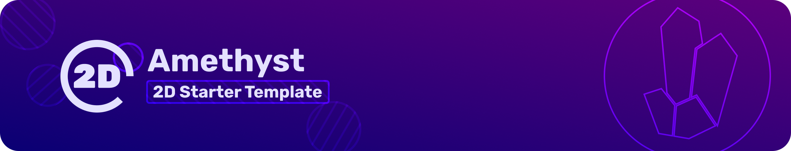
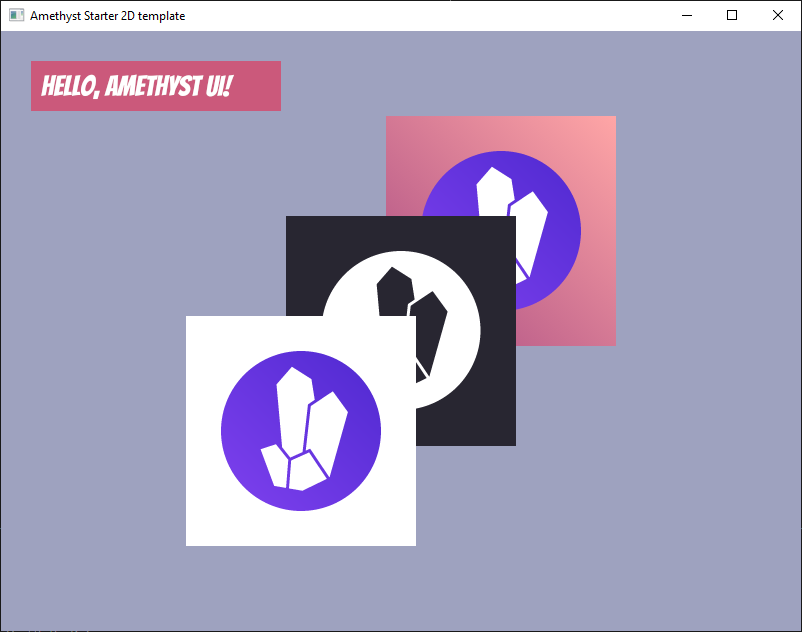

## Summary ##

Humans have never been created; during the start of the Cretaceous Period 150 Million Years Ago (After the Jurrassic Period),
a new form of being came into existence, the **Dracoa**. These creatures started as a infectious bacteria that would feed off of the decomposing
lifeforms throughout the world. They can survive in extreme temperatures and pressures, and would evolve the decomposing body into a new species.
Fast forward 500 years, the **Dracoa** have become the dominiant species on earth, because of their innnate ability to replicate from the dead bodies all around.
However, a rare species of **Dracoa** emerged that was able to have coherent thoughts, not just instinct, and could control those **Dracoa** that were lesser.
This form is known as an Overmind and comprised of 0.001% of the **Dracoa** population.

The Overminds rose incredibly quickly to the top of the food chain, using the lesser **Dracoa** to hunt and gather for them. Over the centuries there has been several
power struggles between the Overminds, each having very unique abilities. Although they have lived in relative peace for years, they still only possess primative
technology, since they rely on the lesser **Dracoa** to do their bidding. One day, they are put to the test, when an advanced civilization comes from space to colonize their planet. They must figure out how to negotiate, fightback,
or they face extinction.

You play as various Overminds, in control of a pack of wights. The wights are the lesser **Dracoa** that only use instincts to survive. You are able to control
the wights and use your inherent bacteria to infect dead organisms to obtain more wights. Since Overminds have strong mental capacities,
their physical capacities lack. Therefore, they must attack and defend with their pack of weights by shooting enemies with their attack or action pheromone.
That is, there will be several kinds of pheremones each commanding the wights to perform a specific action.
The Overminds and only run and dodge from a distance.

Later on, the Overmind gets physical abilties from consuming a wight. This includes the abilities to attack and defend without wights, etc.

## Technical Details ##

This will be a 2D scroller game written in Rust and using the Amethyst game engine.



This project template will get you from 0 to drawing something on the screen in no time. If you're looking for a more in-depth introduction to the engine, please have a look at [our book](https://book.amethyst.rs/stable/)!

This project template also includes a small example of how to draw UI, see in state.rs for create_ui_example().


## Quickstart

- Clone the repository

```bash
git clone https://github.com/amethyst/amethyst-starter-2d.git
cd amethyst-starter-2d
```

- Build and run the project

```bash
cargo run
```

#### For Mac Users

This starter uses vulkan as a renderer by default. You'll want to change the backend to use `metal`, which can be done by opening the `Cargo.toml` file and changing

```toml
[features]
default = ["vulkan"]
```

to

```toml
[features]
default = ["metal"]
```

If using OSX and Metal you will require full XCode installed from the Appstore in order to compile metal shaders.
After install you may be required to run this command `sudo xcode-select --switch /Applications/Xcode.app/Contents/Developer` [reference gfx-rs issue](https://github.com/gfx-rs/gfx/issues/2472)

#### For Linux Users

You might need to install some dependencies. Please refer to [this section](https://github.com/amethyst/amethyst#dependencies) of the README for more details.

## Features

This project contains the minimum amount of code needed to draw sprites to the screen. Here's a small summary of what you'll find in the source files:

- `resources/display_config.ron`  
  Contains the window configuration (size, title).

- `src/main.rs`  
  Creates the render graph, adds the required bundles, builds the game data with our own state and finally, starts the game's main event loop.

- `src/state.rs`  
  Implements the main game state. In the `on_start` hook, the camera is initialized, and the sprites that will be drawn are loaded and their entities created.  
   In the `handle_event` hook, we print any keys that were pressed and close the window if the user presses escape or the OS requests that we quit.
